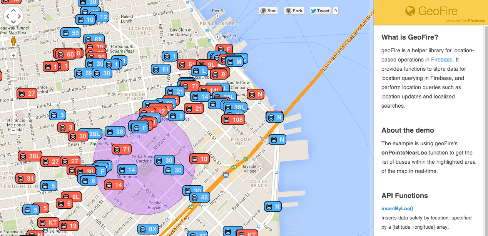

GeoFire
=======
**GeoFire** is a helper library for location-based operations in <a href="https://www.firebase.com/" target="_blank">Firebase.</a> 

It provides functions to store data for location querying in Firebase, 
and perform location queries such as location updates and localized searches.
GeoFire stores the location coordinates of a data point as a <a href="http://en.wikipedia.org/wiki/Geohash" target="_blank">geohash</a> in Firebase.

###<a href="http://firebase.github.io/geoFire/examples/demo/index.html?5" target="_blank">See a live demo of GeoFire here!</a>###

Using the GeoFire library
------------------------
To use the GeoFire library, include the **geoFire.js** file and create a geoFire object with the Firebase reference your data
will be stored at:

    var geoRef = new Firebase('https://abc.firebaseio-demo.com/geodata'),
        geo = new geoFire(geoRef);

You can see your Firebase data at any time by navigating to the geoRef url.

The GeoFire library provides functions to:  
  1. [Store/remove data in Firebase for location queries](#storingremoving-data-for-location-queries)
    - [insertByLoc](#insertbyloclatlon-data-oncomplete)
    - [insertByLocWithId](#insertbylocwithidlatlon-id-data-oncomplete)  
    - [removeById](#removebyidid-oncomplete)

  2. [Perform location queries](#performing-location-queries):  
    - [getLocById](#getlocbyidid-callback)  
    - [updateLocForId](#updatelocforidlatlon-id-oncomplete)

  3. [Perform localized searches] (#performing-localized-searches):  
    - [getPointsNearLoc](#getpointsnearloclatlon-radius-callback)  
    - [onPointsNearLoc](#onpointsnearloclatlon-radius-callback)
    - [offPointsNearLoc](#offpointsnearloclatlon-radius-callback)
    - [getPointsNearId](#getpointsnearidid-radius-callback)
    - [onPointsNearId](#onpointsnearidid-radius-callback)
    - [offPointsNearId](#offpointsnearidid-radius-callback)

The library also has helper functions to:  
  4. [Convert between latitude, longitude pairs and geohashes](#locationgeohash-conversion):  
    - [encode](#encodelatlon-precision)  
    - [decode](#decodegeohash)

  5. [Convert between miles and kilometers](#milekilometer-conversion):  
    - [miles2km](#miles2kmmiles)  
    - [km2miles](#km2mileskilometers)

Storing/removing data for location queries:
------------------------------------------------------------
###insertByLoc(latLon, data, [onComplete])

Inserts data solely by location, specified by a [latitude, longitude] array. On
completion, the optional callback function (if provided) is called with null on
success/ Error on failure.

    var car1 = { id: 1, make: "Tesla" };

    // No callback function.
    geo.insertByLoc([37.771393, -122.447104], car1); 

     // With a callback function.
    geo.insertByLoc([37.771393, -122.447104], car1, function(error) { if (!error) console.log("Insert done!"); });

###insertByLocWithId(latLon, id, data, [onComplete])

Inserts data by location, specified by a [latitude, longitude] array,  and a client-provided identifer.
On completion, the optional callback function (if provided) is called with null
on success/ Error on failure.
**Data that is inserted using this function can be queried using the client-provided Id.**

    var car2 = { id: 2, make: "BMW" };

    // No callback function.
    geo.insertByLocWithId([37.780314, -122.513698], car2.id, car2);

    // With a callback function.
    geo.insertByLocWithId([37.780314, -122.513698], car2.id, car2, function(error) { if (!error) console.log("Insert done!); });

###removeById(id, [onComplete])

Removes the data point with the specified Id; the data point must have been inserted using `insertByLocWithId`.
`removeById` does not return anything; it calls the optional callback function, if provided, with 
null on success/ Error on failure.

    // No callback function.
    geo.removeById(car2.id);

    // With a callback function.
    geo.removeById(car2.id, function(error) { if(!error) console.log("Remove done!"); });

Performing location queries:
----------------------------
###getLocById(id, callback)

Gets the location of the data point with the specified Id; the data point must have been inserted using `insertByLocWithId`.
`getLocById` does not return anything; the location passed to the callback
function as a [latitude, longitude] array on success/ Null on failure.  

    geo.getLocById(car2.id, function(latLon) { if (latLon) console.log("Lat, Lon = ", latLon[0], latLon[1]); });

###updateLocForId(latLon, id, [onComplete])

Updates the location of the data point with the specified Id; the data point must have been inserted using `insertByLocWithId`.
`updateLocForId` does not return anything. The optional callback function, if provided, is called with null on success/ Error on failure.
    
    // No callback.
    geo.updateLocForId([36.01234, -121.51369], car2.id);

    // With a callback function.
    geo.updateLocForId([36.01234, -121.51369], car2.id, function(error) { if (!error) console.log("Update done!"); });

Performing localized searches:
-----------------------------
###getPointsNearLoc(latLon, radius, callback)

Finds all data points within the specified radius, in kilometers, from the
source point, specified as a [latitude, longitude] array.
The function does not return anything; the matching data points are passed
to the callback function as an array in **distance sorted order**. **The callback function is called once, with the initial set of search results;
it is not called when the set of search results changes.**

    geo.getPointsNearLoc([37.771393, -122.447104], 5,
                        function(array) { 
                            for (var i = 0; i < array.length; i++)
                                console.log("A found point = ", array[i]);
                        });

###onPointsNearLoc(latLon, radius, callback)

Finds all data points within the specified radius, in kilometers, from the
source point, specified as a [latitude, longitude] array.
The function does not return anything; the matching data points are passed
to the callback function as an array in **distance sorted order**. **The callback function is called with the initial set of search results and
each time the set of search results changes.**

    geo.onPointsNearLoc([37.771393, -122.447104], 5,
                        function(array) {
                            for (var i = 0; i < array.length; i++)
                                console.log("A found point = ", array[i]);
            });

###offPointsNearLoc(latLon, radius, callback)

Cancels a search that was initiated by `onPointsNearLoc` with the source point, radius and callback specified. If no callback is specified, all
outstanding searches for the source point-radius pair are cancelled. An `offPointsNearLoc` call cancels one outstanding `onPointsNearLoc` call.
The function does not return anything.

    var loc = [37.771393, -122.447104],
        radius = 5,
        myCallback = function() { // Do something };

    geo.onPointsNearLoc(loc, radius, myCallback);

    geo.offPointsNearLoc(loc, radius, myCallback);

###getPointsNearId(id, radius, callback)

Finds all data points within the specified radius, in kilometers, from the
source point, specified by Id. The source point must have been inserted using `insertByLocWithId`.
The function does not return anything; the matching data points are passed
to the callback function as an array in **distance sorted order**. **The callback function is called once, with the initial set of search results;
it is not called when the set of search results changes.**

    geo.getPointsNearId(car2.id, 5,
                       function(array) {
                        for (var i = 0; i < array.length; i++)
                            console.log("A found point = ", array[i]);
                       });

###onPointsNearId(id, radius, callback)

Finds all data points within the specified radius, in kilometers, from the
source point, specified by Id. The source point must have been inserted using `insertByLocWithId`.
The function does not return anything; the matching data points are passed
to the callback function as an array in **distance sorted order**. **The callback function is called with the initial set of search results and
each time the set of search results changes.**

    geo.onPointsNearId(car2.id, 5,
                       function(array) {
                        for (var i = 0; i < array.length; i++)
                            console.log("A found point = ", array[i]);
                       });

###offPointsNearId(id, radius, callback)

Cancels a search that was initiated by `onPointsNearId` with the source point, radius and callback specified. If no callback is specified, all
outstanding searches for the source point-radius pair are cancelled. An `offPointsNearId` call cancels one `onPointsNearId` call.
The function does not return anything.

    var id = car2.id,
        radius = 5,
        myCallback = function() { // Do something };

    geo.onPointsNearId(id, radius, myCallback);

    geo.offPointsNearId(id, radius, myCallback);

**NOTE: You can convert between miles and kilometers with [miles2km](#miles2kmmiles) and [km2miles](#km2mileskilometers).**

Location/geohash conversion:
---------------------------
**NOTE: You probably don't need the functions in this section.**

A geohash is a string representation of a location coordinate which is generated by interleaving the
bit representations of the latitude and longitude pair and base32-encoding the result.  

The *precision* of a geohash is determined by its string length; a longer geohash represents a smaller
bounding box around the location coordinate.  

Geohashes have a neat property that makes them suitable for localized search: points with similar geohashes are near each other. 
(It's worth noting that points that are near each other may not have similar geohashes though.)  

You can learn about geohashes at: <a href="http://en.wikipedia.org/wiki/Geohash" target="_blank">the wikipedia page</a> or 
<a href="http://www.bigfastblog.com/geohash-intro" target="_blank">this blog post</a>.

###encode(latLon, precision)

Generates a geohash of the specified [precision](#precision) for the [latitude, longitude] pair, specified as an array.

    var loc = [37.757008, -122.421237];
    var geohash = geo.encode(loc, 12); // geohash = "9q8yy1rwd2mt" 

###decode(geohash)

Returns the location of the center of the bounding box the geohash represents;
the location is returned as a [latitude, longitude] array.

    var location = geo.decode("q8yy1rwd2mt");
    var latitude = location[0]; // latitude = 37.757008
    var longitude = location[1]; // longitude = -122.421237

Mile/Kilometer conversion:
--------------------------
###miles2km(miles)

Returns kilometers from miles.

###km2miles(kilometers)

Returns miles from kilometers.
